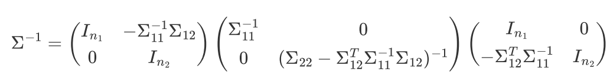

# Hw1 & Hw2

> PB20020480 王润泽
>
> Machine Learning

## Hw1

1. ##### 计算 $\frac{\part \ln \det{\bold A}}{\part x}$

$$
\begin{align}

\frac{\part \ln \det{\bold A}}{\part x}&={\frac{\tr\ln\bold A}{\part x}}\\
&=\trace{(\frac{\part \ln \bold A}{\part x})}\\
&=\trace{(A^{-1}\frac{\part \bold A}{\part x})}
\end{align}
$$

2. ##### 西瓜书 1.2

在不包括*的情况下，单个合取式所能表示的假设有 $2×3×3=18$ 种。所以在 K 足够大时，可能的假设有 $2^{18}=262144$ 种，而析取范式有 $3×4×4=48$ 种

当 **k=9时**，最多包含9个合取式的析合范式能表示 ： 262144 种假设，能够包含全部假设空间

3. ##### 已知随机变量 $x=[x_1,x_2]\sim \mathcal N(\mu,\Sigma)$, 计算 $P(x_1)$, $P(x_1|x_2)$

假设 $x\in \mathbb R^n$, $x_1\in \mathbb R^{n_1}$, $x_2\in \mathbb R^{n_2}$, $n_1+n_2=n$,那么
$$
\begin{align}
P(x_1)&=\int_{\mathbb R^{n_2}}f(x)dx_2\\
&=\int_{\mathbb R^{n_2}}\frac{1}{(\sqrt{2\pi})^n\det{\Sigma}}\exp{\left(-\frac12(x-\mu)^T\Sigma^{-1}(x-\mu)\right)}dx_2
\end{align}
$$
为了确定关于 $x_1$ 部分，需要对 $\Sigma^{-1}$ 进行拆分，由 $\Sigma$ 正定，顺序主子式 $\vert\Sigma_{11}\vert>0$, 所以 $\Sigma_{11}$ 可逆，则


取逆



那么 $(x-\mu)^T\Sigma^{-1}(x-\mu)$ 项写作
$$
(x_1-\mu_1)^T\Sigma_{11}^{-1}(x_1-\mu_1)+\left[(x_2-\mu_2)-\Sigma_{12}^T\Sigma_{11}^{-1}(x_1-\mu_1)\right]^T\Sigma^{*}\left[(x_2-\mu_2)-\Sigma_{12}^T\Sigma_{11}^{-1}(x_1-\mu_1)\right]
$$
其中  $\mu^*(x_1)=\mu_2+\Sigma_{12}^T\Sigma_{11}^{-1}(x_1-\mu_1)$ , $\Sigma^{*}=\Sigma_{22}-\Sigma_{12}^T\Sigma_{11}^{-1}\Sigma_{12}$

于是可将 $x_1,x_2$ 拆分开
$$
P(x_1)=\frac{N(\mu_1,\Sigma_{11})\det{\Sigma}_{11}}{(\sqrt{2\pi})^{n_2}\det{\Sigma}}  \int_{\mathbb R^{n_2}}\exp\left[(x_2-\mu^*)^T\Sigma^{*}(x_2-\mu^*)\right]dx_2
$$
对 $x_2$ 积分即是对分布为
$$
\mathcal N(\mu^*(x_1),\Sigma^*)
$$
的高斯分布积分，积分结果与 **bias**无关，那么积分结果必然满足分布
$$
x_1\sim\mathcal N(\mu_1,\Sigma_{11})
$$
同理，按照上面的分解条件分布为
$$
P(x_1|x_2)=\frac{P(x_1,x_2)}{P(x_2)}\\
=\mathcal N\left(\mu_1+\Sigma_{12}\Sigma_{22}^{-1}(x_2-\mu_2),\Sigma_{11}-\Sigma_{12}\Sigma_{22}^{-1}\Sigma_{12}^T\right)
$$

4. ##### 证明 $||x||_p$ 是凸函数

对 $\forall t\in(0,1), u,v\in \mathbb R^n,p>1$，有
$$
||tu+(1-t)v||_p\le ||tu||_p+||(1-t)v||_p=t||u||_p+(1-t)||v||_p
$$

5. ##### 证明判定凸函数的0阶和1阶条件相互等价

 充分性：

对 $\forall t\in [0,1]$, $f(tx+(1-t)y)\le tf(x)+(1-t)f(y)$

令 $g(t)=tf(x)+(1-t)f(y)-f(tx+(1-t)y)$, 显然 $g(0)=0$, $g(t)\ge 0$, $t\in [0,1]$，易得
$$
g'(t)=f(x)-f(y)-\nabla f(tx+(1-t)y)^T(x-y)
$$

$$
\lim_{t\rarr1}g'(t)=f(x)-f(y)-\nabla f(x)^T(x-y)\le0
$$

故
$$
f(y)\ge f(x)+\nabla f(x)^T(x-y)
$$
必要性：

设 $f(y)\ge f(x)+\nabla f(x)^T(x-y)$. 易得 $\lim_{t\rarr0}g'(t)\ge0$, $\lim_{t\rarr1}g'(t)\le0$，而
$$
g''(t)=-(x-y)^T\Delta f(tx+(1-t)y)(x-y)
$$
而由于
$$
f(y)-f(x)-\nabla f(x)^T(y-x)=(y-x)^T\Delta f(x)(y-x)+O(|y-x|^3)\ge 0
$$
当 $|y-x|\rarr 0 $ 时，有 $(y-x)^T\Delta f(x)(y-x)\ge 0$,所以 $\Delta f$ 是半正定的，即有
$$
g''(t)\le0
$$
因而可以得到 $g(t)$ 只存在一个极大值点，故 $g(t)\ge 0$ , 即有
$$
f(tx+(1-t)y)\le tf(x)+(1-t)f(y)
$$
0阶条件得证

## Hw2

1. ##### 习题2.2

十折交叉验证要求我们保证每个⼦集尽可能保持数据分布的⼀致性，即正反例数量相同，那么最终判断的错误率期望为 **50%**

留一法的则是 $k=m$ 的情况下，在训练集中留下较多的样本肯定不是测试集的样本，这样错误率为 **100%**

2. ##### 习题2.4

由混淆矩阵

|          | 预测为正 | 预测为反 |
| -------- | -------- | -------- |
| 实际为正 | TP       | FN       |
| 实际为反 | FP       | TN       |

真正率：$TPR=\frac{TP}{TP+FN}$, 假正率：$FPR=\frac{FP}{FP+TN}$

查全率：$R=\frac{TP}{TP+FN}$，查准率：$P=\frac{TP}{TP+FP}$

其中 **TPR=R** , 一般查准率越高，查全率就越低

3. ##### 习题2.5

不妨将 ROC 曲线的横坐标扩大 $m^-$ 倍，纵坐标扩大 $m^+$ 倍，这样绘制 ROC 曲线图时每一步都⾛⼀个单位⻓度，⽅便说明ROC曲线构造过程

Step1.  ⽤分类器对所有数据分类，得到结果为⼀个 $[0,1]$ 的值，值越⼤说明越容易被判定为正

Step2. 将所有数据按预测结果降序排列

Step3. 从最⼤预测结果开始，如果实际为真，向上⾛⼀步，如果实际为假，向右⾛⼀步

Step4. 如果有若⼲样本预测结果相同，先同时向右、上⾛相应的步数，将起点终点直接相连

对于上述构造过程，对于每⼀个反样本（即向右⾛），我们假设没有样本预测结果与之相同。在正样本中：比其预测结果大的，已经在 其之前绘制（即已经向上⾛过了），在 ROC 曲线中表现为曲线之下的部分；反之，比其预测结果小的，还未绘制，且终将在其之后绘制，在 ROC 曲线中表现为曲线之上的部分。曲线之上的部分对应
$$
\sum_{x^-}\sum_{x^+}\mathbb I(f(x^+)<f(x^-))
$$
假如有 p,q 个正、反样本预测结果相同，除了 曲线之上的部分,还需要计算起点终点直接相连的三⻆形部分 . 在 loss 中对应为,即
$$
\sum_{x^+}\sum_{x^-}\frac12\mathbb I(f(x^+)=f(x^-))
$$
重新对坐标轴进行放缩即可证明 loss为
$$
\frac{1}{m^+ m^-}\sum_{x^+}\sum_{x^-} \mathbb I(f(x^+)<f(x^-))+\frac12\mathbb I(f(x^+)=f(x^-))
$$

4. ##### 习题2.9

- 提出原假设和备择假设，离散情况下 $H_0:P(X=x_i)=p_i,i=1,2...$ , 连续情况下 $H_0:X\sim F(x)$
- 将 $X$ 的取值范围划分为 $k$ 个互不相交的⼦区间 , 一般 $k>5$
- 记落入 $A_i$ 区间的样本个数为 $n_i$, 其中 $\sum_i n_i=n$
- 记随机样本落入 $A_i$ 区间的概率为 $q_i$
- 计算

$$
\chi^2=\sum_{i=1}^k \frac{(n_i-nq_i)^2}{nq_i}
$$

$$
\chi^2\sim \chi^2_{k-1}
$$

5. ##### 如何按照比例对给定数据集做随机划分

可以假设数据的长度为 $n$，先对数据进行混洗，然后就按比例划分即可，混洗的算法可以采用洗牌思想：从一个列表的前缀中随机取一个位置，和前缀的末尾做交换，这样对于每一位，都类似洗牌把它随机插进前面某个位置，就能实现把整个列表打乱成随机的分布

```python
def shuffle(seq):
    for i in range(len(seq) - 1, 0, -1):
        j = random.randint(0, i)  # 生成一个随机索引 j，0 <= j <= i
        seq[i], seq[j] = seq[j], seq[i]  # 交换元素
train_set,test_set = seq[0:int(n*p)],seq[int(n*p):]
```

